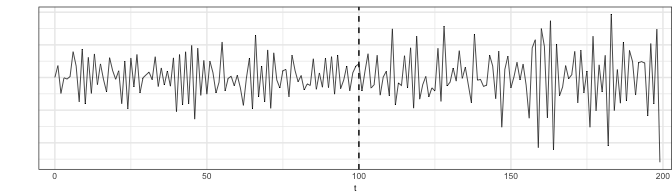

Parametric tests for comparing time series
================

This page contains R code to implement the likelihood ratio tests for
comparing two time series described in:

Grant, AJ and Quinn, BG (2017). Parametric spectral discrimination.
*Journal of Time Series Analysis*, 38(6):838–864. doi:
<https://doi.org/10.1111/jtsa.12238>

Ma, L, Grant, AJ and Sofronov, G. Multiple change point detection and
validation in autoregressive time series data (2020). *Statistical
papers*, 61:1507–1528. doi: <https://doi.org/10.1007/s00362-020-01198-w>

The file `ardisc_fun.R` contains the function `ardisc()` to implement
these tests.

## Simulation example: change point validation

In this example, a time series is generated of length $T=200$, with a
change in innovation variance at time $t=100$. The segments either side
of this point are realisations from AR(1) processes, denoted
$\left\lbrace X_t \right\rbrace$ and $\left\lbrace Y_t \right\rbrace$,
respectively, where $$
X_t + 0.7X_{t-1} = \varepsilon_t,\quad \varepsilon_t \sim N\left(0, 1\right)\\
Y_t + 0.7Y_{t-1} = u_t,\quad u_t \sim N\left(0, 2\right),
$$ where $\varepsilon_t$ and $u_t$ are independent innovation processes.

The time series is generated using the [`signal`
package](https://r-forge.r-project.org/projects/signal/).

``` r
set.seed(20260902)
T0 = 200
ex = rnorm(T0/2, 0, 1)
ey = rnorm(T0/2, 0, sqrt(2))
z = signal::filter(1, c(1, 0.7), c(ex, ey))
```

The plots below show A) the full time series, B) the autocovariance
functions, and C) the autocorrelation functions, up to lag
$p=\left\lfloor \left(\textrm{log} 100 \right)^{1.01 }\right\rfloor = 4$.

<!-- -->

### The null hypotheses

The goal is to apply the likelihood ratio procedure to test whether
there is a true change point at time $t=100$. The time series will be
modelled as autoregressions of order 4, that is $$
\begin{align}
X_t + \sum_{j=1}^4 \beta_{X,j} X_{t-j} &= \varepsilon_t\\
Y_t + \sum_{j=1}^4 \beta_{Y,j} Y_{t-j} &= u_t,
\end{align}
$$

where $\textrm{var}\left(\varepsilon_t\right)=\sigma^2_{\varepsilon}$
and $\textrm{var}\left(u_t\right)=\sigma^2_{u}$. Three hypothesis tests
will be applied, each considering a different definition of a change
point.

$$
\begin{align}
&H_0^{\left(1\right)}: \beta_{X,1} = \cdots = \beta_{X,4}\\
&H_0^{\left(2\right)}: \beta_{X,1} = \cdots = \beta_{X,4},\, \sigma^2_{\varepsilon}=\sigma^2_{u}\\
&H_0^{\left(3\right)}: \beta_{X,1} = \cdots = \beta_{X,4},\, \sigma^2_{\varepsilon}=\sigma^2_{u}, E\left(X_t\right) = E\left(Y_t\right)
\end{align}
$$ Under $H_0^{\left(1\right)}$, $\left\lbrace X_t \right\rbrace$ and
$\left\lbrace Y_t \right\rbrace$ have the same autocorrelation
structure. Under $H_0^{\left(2\right)}$,
$\left\lbrace X_t \right\rbrace$ and $\left\lbrace Y_t \right\rbrace$
have the same autocovariance function. Under $H_0^{\left(3\right)}$,
$\left\lbrace X_t \right\rbrace$ and $\left\lbrace Y_t \right\rbrace$
have the same autocovariance function and the same mean.

### Parameter estimation under the alternative hypotheses

Under the alternative hypotheses, $\left\lbrace X_t \right\rbrace$ and
$\left\lbrace Y_t \right\rbrace$ are independent processes and their
parameters can be estimated separately using the Levinson-Durbin
algorithm. The `acf()` function is first used to compute the sample
autocovariance functions up to lag $4$. These are then input into the
`ldar()` function.

``` r
cx = acf(z[1:(T0/2)], p = 4)
parestx = ldar(cx)
print(parestx)
```

    ## $b
    ## [1]  0.75142561  0.10784232  0.06015640 -0.05096864
    ## 
    ## $s
    ##           [,1]
    ## [1,] 0.8747836

``` r
cy = acf(z[(T0/2+1):T0], p = 4)
paresty = ldar(cy)
print(paresty)
```

    ## $b
    ## [1]  0.79131700  0.26770046  0.03136632 -0.03115783
    ## 
    ## $s
    ##          [,1]
    ## [1,] 2.761402

### Testing $H_0^{\left(1\right)}$

Under $H_0^{\left(1\right)}$, the autoregressive parameters of
$\left\lbrace X_t \right\rbrace$ and $\left\lbrace Y_t \right\rbrace$
are the same, but the innovation variances and means may be different.
We can therefore estimate the common autoregressive parameters, the
innovation variances under the null, and the test statistic using the
`ardisc()` function with the default arguments of `mu_cp = FALSE` and
`sigma_cp = FALSE`.

``` r
test_H01 = ardisc(z[1:(T0/2)], z[(T0/2+1):T0], mu_cp = FALSE, sigma_cp = FALSE)
print(test_H01)
```

    ## $pvalue
    ##           [,1]
    ## [1,] 0.6224368
    ## 
    ## $l
    ##          [,1]
    ## [1,] 2.624797
    ## 
    ## $df
    ## [1] 4
    ## 
    ## $cx
    ## [1]  1.8647435 -1.3502291  0.9427753 -0.7438093  0.6335146
    ## 
    ## $cy
    ## [1]  4.8895895 -3.0943428  1.2764916 -0.4315339  0.2491699
    ## 
    ## $c
    ## [1]  3.3771665 -2.2222860  1.1096335 -0.5876716  0.4413422
    ## 
    ## $b0
    ## [1]  0.78075085  0.18787605  0.04217553 -0.05272377
    ## 
    ## $sx0
    ##           [,1]
    ## [1,] 0.8852207
    ## 
    ## $sy0
    ##          [,1]
    ## [1,] 2.801418

### Testing $H_0^{\left(2\right)}$

Under $H_0^{\left(2\right)}$, the autoregressive parameters and
innovation variances of $\left\lbrace X_t \right\rbrace$ and
$\left\lbrace Y_t \right\rbrace$ are the same, but the means may be
different. We can therefore estimate the common autoregressive
parameters, the innovation variances under the null, and the test
statistic using the `ardisc()` function with the default arguments of
`mu_cp = FALSE` and `sigma_cp = TRUE`.

``` r
test_H02 = ardisc(z[1:(T0/2)], z[(T0/2+1):T0], mu_cp = FALSE, sigma_cp = TRUE)
print(test_H02)
```

    ## $pvalue
    ##              [,1]
    ## [1,] 3.143184e-06
    ## 
    ## $l
    ##          [,1]
    ## [1,] 33.39369
    ## 
    ## $df
    ## [1] 5
    ## 
    ## $cx
    ## [1]  1.8647435 -1.3502291  0.9427753 -0.7438093  0.6335146
    ## 
    ## $cy
    ## [1]  4.8895895 -3.0943428  1.2764916 -0.4315339  0.2491699
    ## 
    ## $c
    ## [1]  3.3771665 -2.2222860  1.1096335 -0.5876716  0.4413422
    ## 
    ## $b0
    ## [1]  0.78919302  0.22912960  0.03583208 -0.04506046
    ## 
    ## $sx0
    ##          [,1]
    ## [1,] 1.836659
    ## 
    ## $sy0
    ##          [,1]
    ## [1,] 1.836659

### Testing $H_0^{\left(3\right)}$

Under $H_0^{\left(3\right)}$, the autoregressive parameters, innovation
variances, and means of $\left\lbrace X_t \right\rbrace$ and
$\left\lbrace Y_t \right\rbrace$ are the same. We can therefore estimate
the common autoregressive parameters, the innovation variances under the
null, and the test statistic using the `ardisc()` function with the
default arguments of `mu_cp = TRUE` and `sigma_cp = TRUE`.

``` r
test_H02 = ardisc(z[1:(T0/2)], z[(T0/2+1):T0], mu_cp = TRUE, sigma_cp = TRUE)
print(test_H02)
```

    ## $pvalue
    ##              [,1]
    ## [1,] 8.835357e-06
    ## 
    ## $l
    ##          [,1]
    ## [1,] 33.38629
    ## 
    ## $df
    ## [1] 6
    ## 
    ## $cx
    ## [1]  1.8647435 -1.3502291  0.9427753 -0.7438093  0.6335146
    ## 
    ## $cy
    ## [1]  4.8895895 -3.0943428  1.2764916 -0.4315339  0.2491699
    ## 
    ## $c
    ## [1]  3.3771675 -2.2223158  1.1096103 -0.5876912  0.4413400
    ## 
    ## $b0
    ## [1]  0.78923914  0.22921195  0.03590978 -0.04502121
    ## 
    ## $sx0
    ##          [,1]
    ## [1,] 1.836591
    ## 
    ## $sy0
    ##          [,1]
    ## [1,] 1.836591
